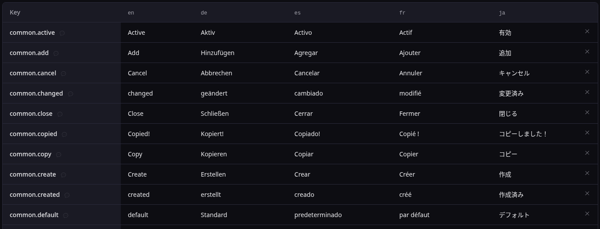

# Parlats

An open-core translation management platform for teams that build multi-language applications. It replaces the painful workflow of editing translation files by hand, juggling spreadsheets, or paying for expensive SaaS services.

Translators get a fast, clean editing interface. Developers import/export files and use a CLI. Product managers see coverage at a glance. Everyone gets a full audit trail of what changed and when.



## Key Features

- **Import diff preview** — see exactly what will change before applying bulk imports, with per-cell accept/reject
- **Interpolation-aware editor** — validation for `{{variables}}`, component tags, and ICU message syntax
- **Coverage dashboard** — color-coded translation progress across all projects at a glance
- **CLI** — first-class developer tool for init/pull/push/status workflows
- **REST API** — full CRUD with API key authentication for CI/CD integration
- **Multi-tenant** — organization-based access with roles (owner, admin, editor, viewer)
- **Change history** — full audit trail with per-key and per-language filtering
- **Multiple formats** — JSON (flat/nested), YAML, CSV, XLSX import and export

## Tech Stack

Bun, TypeScript, PostgreSQL, Nunjucks, HTMX, Tailwind CSS. Server-rendered HTML — no heavy SPA, instant page loads.

## Getting Started

### Prerequisites

- [Bun](https://bun.sh)
- [Podman](https://podman.io) or Docker

### Setup

```sh
cp .env.example .env
bun install
podman compose up -d db   # start PostgreSQL on port 5433
bun run migrate            # run database migrations
bun run dev                # start dev server
```

The app runs at `http://localhost:3100`. Register an account to get started.

Google OAuth is optional — email + password authentication works out of the box. To enable Google login, fill in the `GOOGLE_CLIENT_ID` and `GOOGLE_CLIENT_SECRET` in your `.env`.

## CLI

Install from npm:

```sh
npm install -g @parlats/cli
```

Then in your project:

```sh
parlats init     # configure project connection
parlats pull     # download translations
parlats push     # upload translations with diff detection
parlats status   # view translation progress
```

Supports presets for next-intl, i18next, react-intl, and vue-i18n. See the [cli/](cli/) directory for development setup.

## License

[AGPL-3.0](LICENSE). Self-hosted version is fully functional with no artificial limits.
